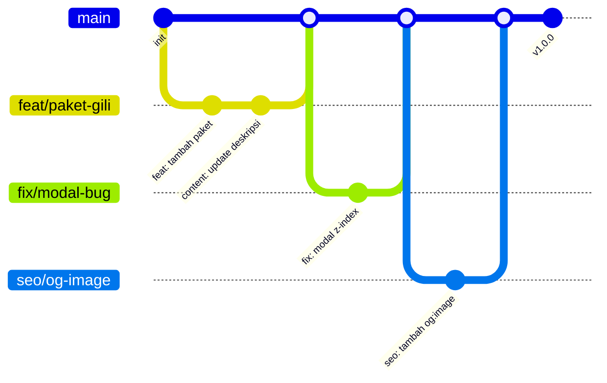

# Git Workflow — Azizan Travel

> Strategi branching & commit convention untuk pengembangan Azizan Travel.

---

## 1. Branch Strategy

### Branch Utama

```
main ─────────────── Production (hanya kode yang sudah di-review & di-QA)
  │
  └── staging ────── Pre-production (uji coba sebelum main)
```

### Branch Fitur

```
main
  │
  ├── feat/tambah-paket-gili       ✨ Fitur baru
  ├── fix/broken-link-navbar       🐛 Bug fix
  ├── content/artikel-senggigi     📝 Update konten
  ├── style/polish-responsive      💄 Polish CSS
  ├── seo/meta-tags-blog           🔍 SEO
  └── refactor/cleanup-js          ♻️ Refactor
```

### Naming Convention

```
<type>/<deskripsi-singkat>

Format type:
feat/       — Fitur baru
fix/        — Bug fix
content/    — Update konten / blog
style/      — Perubahan CSS / UI
seo/        — SEO improvement
refactor/   — Refactor kode (tanpa ubah fungsi)
perf/       — Performance improvement
docs/       — Update dokumentasi
```

Contoh:
```
feat/tambah-paket-gili-trawangan
fix/perbaiki-modal-di-mobile
content/artikel-pantai-senggigi
style/polish-card-shadow
seo/tambah-og-image
```

---

## 2. Commit Convention

### Format Commit

```
<type>: <deskripsi singkat (max 72 char)>

<opsional: body, jelaskan kenapa & apa>
```

### Type yang dipakai

| Type | Emoji | Keterangan |
|------|-------|------------|
| `feat` | ✨ | Fitur baru |
| `fix` | 🐛 | Bug fix |
| `content` | 📝 | Update konten/blog |
| `style` | 💄 | Polish CSS/UI |
| `seo` | 🔍 | SEO optimization |
| `refactor` | ♻️ | Refactor tanpa ubah perilaku |
| `perf` | ⚡ | Performance |
| `docs` | 📖 | Update dokumentasi |
| `chore` | 🔧 | Tooling, config, dependency |

### Contoh Commit (baik)

```
feat: tambah paket Tour Gili 3 Hari

- Harga Rp 1.2jt/orang
- Include: transport, guide, makan 3x
- Tambah di index.html dan paket.html
```

```
fix: perbaiki modal booking tidak muncul di mobile

- z-index modal lebih tinggi dari bottom nav
- Tambah preventDefault di touch event
```

```
content: tambah artikel 5 Pantai Tersembunyi di Lombok

- Artikel baru di js/blog.js
- Tags: pantai, lombok, hidden gem
```

```
style: polish card shadow & spacing

- Ganti --shadow-md jadi lebih soft
- Tambah gap di packages-grid
```

### Contoh Commit (buruk — jangan)

```
update
fix bug
tambahin sesuatu
perbaikan dikit
```

---

## 3. Workflow Sehari-hari

### Mulai fitur baru

```bash
# 1. Pastikan main latest
git checkout main
git pull origin main

# 2. Buat branch fitur
git checkout -b feat/tambah-paket-gili

# 3. Kerjakan fitur...
# (edit file, test lokal)

# 4. Stage & commit
git add index.html
git add paket.html
git commit -m "feat: tambah paket Tour Gili 3 Hari"

# 5. Push ke remote
git push origin feat/tambah-paket-gili
```

### Update setelah selesai fitur

```bash
# 1. Pastikan branch fitur sudah commit semua
git status

# 2. Merge latest main ke branch fitur
git fetch origin
git merge origin/main
# (resolve conflict jika ada)

# 3. Push
git push origin feat/tambah-paket-gili
```

### Bug fix darurat

```bash
git checkout main
git pull origin main
git checkout -b fix/broken-link
# fix...
git add .
git commit -m "fix: perbaiki link broken di footer"
git push origin fix/broken-link
# → langsung PR & merge ke main
```

---

## 4. Pull Request (PR) Workflow

### Checklist sebelum bikin PR

- [ ] Semua commit udah di-push
- [ ] Sudah merge `main` terbaru
- [ ] QA checklist minimal udah dijalanin
- [ ] Tidak ada code yang di-comment-out
- [ ] Tidak ada `console.log` sisa debugging

### Format PR

```
Title: [feat/fix/style] Deskripsi singkat

Body:
## Deskripsi
Apa yang diubah & kenapa

## Changes
- File1: perubahan
- File2: perubahan

## QA
- [ ] Tested di Chrome
- [ ] Mobile responsive OK
- [ ] Booking flow OK

## Screenshots (jika ada)
...
```

### Merge ke main

```
git checkout main
git merge --no-ff feat/tambah-paket-gili
git push origin main
```

Atau via GitHub: **Create Pull Request → Merge**.

Gunakan `--no-ff` agar history branch tetap terlihat.

---

## 5. Release Workflow

```
main ──── feat A ──── feat B ──── fix C ──── (release v1.2.0)
```

### Tagging (optional untuk major update)

```bash
git tag -a v1.2.0 -m "Release v1.2.0 - Fitur paket Gili"
git push origin v1.2.0
```

---

## 6. Resolve Conflict

```bash
# Saat merge ada conflict:
git merge origin/main
# → Editor akan muncul, cari bagian <<<<<<< ====== >>>>>>>
# → Edit, hapus marker, simpan
git add .
git commit -m "merge: resolve conflict di index.html"
```

**Tips:**
- Conflict biasanya di `index.html` (section baru ketambah)
- Prioritaskan kedua perubahan (jangan buang salah satu)
- Cek hasil merge di browser

---

## 7. Diagram Alur Git



---

## 8. Aturan Penting

### ✅ Lakukan
- Commit sering, jangan ditumpuk
- Gunakan type prefix yang sesuai
- Pull `main` sebelum mulai fitur baru
- Tulis deskripsi commit yang jelas

### ❌ JANGAN
- `git commit -m "update"` — tidak informatif
- Commit langsung ke `main` (kecuali emergency fix dan sudah QA)
- Push force ke branch `main`
- Campur multiple fitur dalam 1 branch
- Commit file yang gak relevan (`node_modules/`, `.env`, dll)

---

## Referensi

| File | Isi |
|------|-----|
| `WORKFLOW.md` | Alur development end-to-end |
| `DEPLOYMENT.md` | Panduan deploy lengkap |
| `QA-CHECKLIST.md` | Checklist quality assurance |
| `AGENTS.md` | Konvensi kode & setup project |
