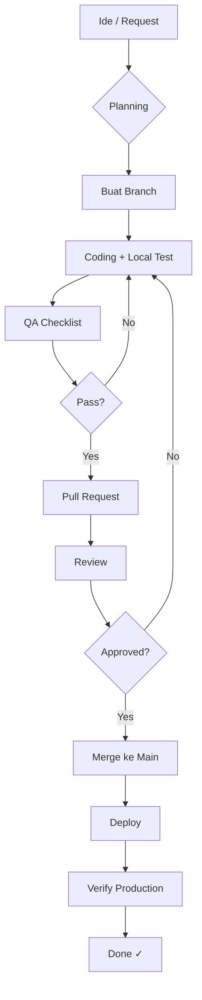

# Workflow Development — Azizan Travel

> Panduan end-to-end untuk mengelola pengembangan website Azizan Travel.
> Dokumen terkait: `DEPLOYMENT.md`, `QA-CHECKLIST.md`, `GIT-WORKFLOW.md`, `AGENTS.md`

---

## 1. Alur Pengembangan (Lifecycle)

```
┌─────────────┐     ┌────────────┐     ┌───────────┐     ┌──────────┐     ┌────────────┐
│  Planning   │ ──> │  Develop   │ ──> │  Review   │ ──> │  QA/Test │ ──> │  Deploy    │
│             │     │            │     │           │     │          │     │            │
│ - Analisa   │     │ - Coding   │     │ - Peer     │     │ - Check   │     │ - Staging  │
│ - Riset     │     │ - Testing  │     │   Review   │     │   List   │     │ - Production│
│ - Desain    │     │   Lokal    │     │ - AI Agent │     │ - Validasi│     │ - Verify   │
└─────────────┘     └────────────┘     └───────────┘     └──────────┘     └────────────┘
```

---

## 2. Planning

### Checklist sebelum mulai ngerjain fitur:
- [ ] Pahami requirement & tujuan
- [ ] Cek file existing untuk pola kode yang sudah ada
- [ ] Tentukan file mana yang perlu diubah
- [ ] Untuk konten baru: siapkan teks & gambar
- [ ] Untuk paket baru: siapkan detail, harga, include list

### Tools:
| Tool | Fungsi |
|------|--------|
| `AGENTS.md` | Cek konvensi kode & design tokens |
| `css/style.css` | Cek CSS variables yang tersedia |
| `js/main.js` | Cek CONFIG & fungsi global |
| Browser DevTools | Inspeksi elemen, responsive mode |

---

## 3. Development

### a. Persiapan

1. **Sync dengan base terbaru**
   ```bash
   git checkout main
   git pull origin main
   git checkout -b feat/nama-fitur
   ```

2. **Baca file terkait**
   ```bash
   # Minimal baca file yang akan diedit
   cat index.html          # untuk homepage
   cat css/style.css        # untuk styling
   cat js/main.js           # untuk JavaScript
   ```

### b. Saat Coding (via opencode)

**Buat task di opencode untuk setiap pekerjaan:**

```
Task: Tambah paket wisata baru "Tour Gili 3 Hari"
Agent: @package-manager
File: index.html, paket.html
```

**Gunakan agent yang sesuai:**
| Agent | Dipanggil untuk |
|-------|----------------|
| `@content-writer` | Nulis blog, update konten |
| `@package-manager` | Tambah paket wisata |
| `@ui-polisher` | Polish CSS, responsive fix |
| `@seo-auditor` | SEO audit & optimasi |

### c. Commit Conventions

Gunakan prefix di pesan commit:
```
feat:     ✨ Fitur baru
fix:      🐛 Bug fix
style:    💄 Polish CSS/UI
content:  📝 Update konten/blog
seo:      🔍 SEO improvement
refactor: ♻️ Refactor kode
perf:     ⚡ Performance
```

Contoh:
```
feat: tambah paket Tour Gili 3 Hari
fix: perbaiki broken link di navbar mobile
seo: tambah og:image di blog-detail
```

---

## 4. Review & QA

Sebelum minta review atau merge, jalankan QA checklist.

### Minimal check (wajib):
- [ ] Buka di Chrome & Firefox — tidak ada error console
- [ ] Cek semua link/page navigasi
- [ ] Test booking modal — apakah WA URL bener?
- [ ] Mobile responsive: buka di viewport 375px & 768px
- [ ] Gambar muncul semua, alt text ada
- [ ] Loading speed ok (cek Network tab)

### Jika ada perubahan CSS:
- [ ] Cek scroll reveal animation berfungsi
- [ ] Bottom nav mobile muncul di < 768px
- [ ] WA float button muncul di > 768px
- [ ] Navbar scroll effect berfungsi

### Jika ada perubahan JS:
- [ ] Console log bebas error
- [ ] Event listener jalan (click, scroll, submit)
- [ ] IntersectionObserver untuk scroll reveal

**Untuk QA lengkap, lihat `QA-CHECKLIST.md`.**

---

## 5. Deployment

### Staging (optional)
- Bisa deploy ke GitHub Pages / Netlify untuk preview
- URL staging: `https://azizan-travel.netlify.app/`

### Production
- Proses deploy ada di `DEPLOYMENT.md`
- Setelah deploy, verifikasi:
  - [ ] Semua halaman bisa diakses
  - [ ] Form booking WA berfungsi
  - [ ] Gambar & asset termuat
  - [ ] Meta tags muncul (cek dengan Facebook Sharing Debugger)

---

## 6. Maintenance

### Rutin:
| Frekuensi | Aktivitas |
|-----------|-----------|
| Bulanan | Update konten blog |
| Bulanan | Cek broken links |
| 3 Bulan | Update paket wisata & harga |
| 6 Bulan | SEO audit ulang |
| 12 Bulan | Redesign / major update |

### Monitoring:
- Google Search Console: pantau indexed pages
- Google Analytics: pantau traffic
- Manual: buka website di berbagai device

---

## 7. Emergency Fix

Jika ada bug kritis di production:

1. **Buat branch fix**
   ```bash
   git checkout -b fix/nama-bug
   ```

2. **Fix langsung, jangan lewatin planning panjang**
3. **QA minimal** (buka halaman, cek fungsionalitas yang broken)
4. **Deploy segera** — merge ke main + deploy
5. **Buat laporan** — apa yang terjadi & bagaimana preventifnya

---

## 8. Diagram Alur Lengkap



---

## Referensi

| File | Isi |
|------|-----|
| `AGENTS.md` | Konvensi kode, file structure, design tokens |
| `DEPLOYMENT.md` | Panduan deploy lengkap |
| `QA-CHECKLIST.md` | Checklist quality assurance |
| `GIT-WORKFLOW.md` | Strategi branching & commit |
